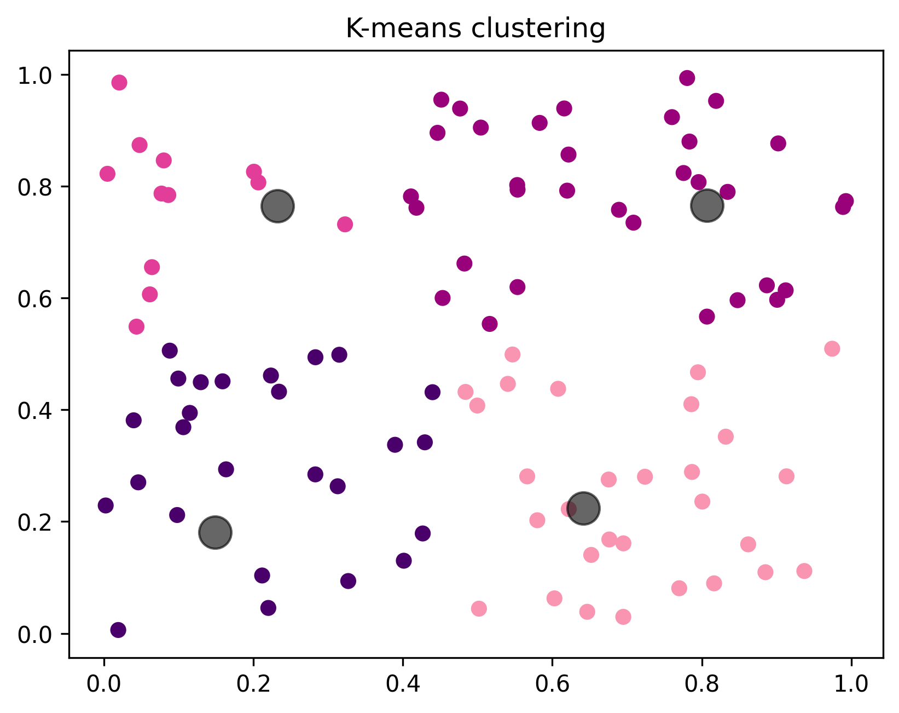
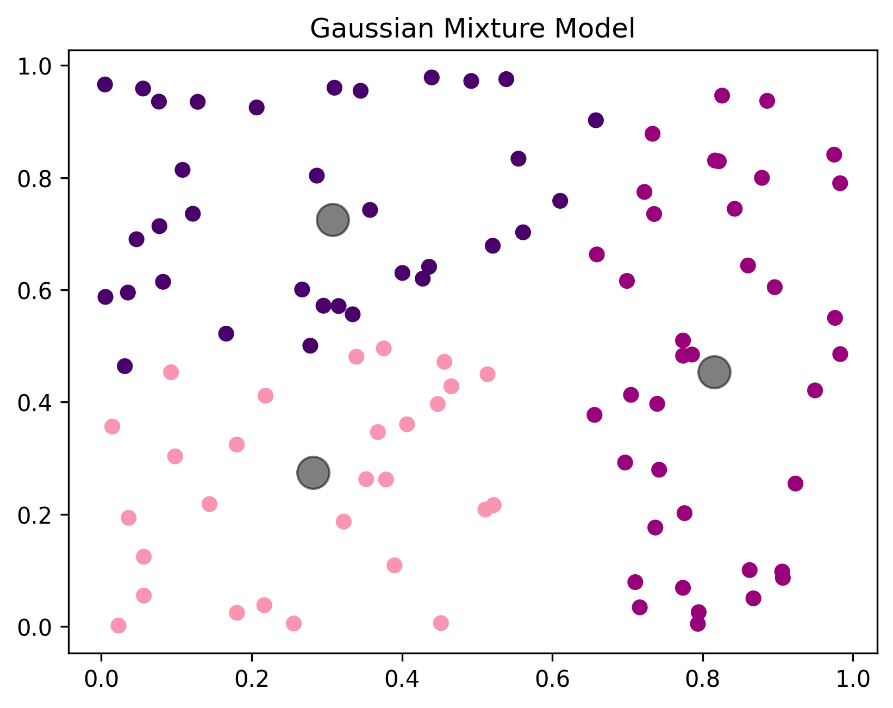
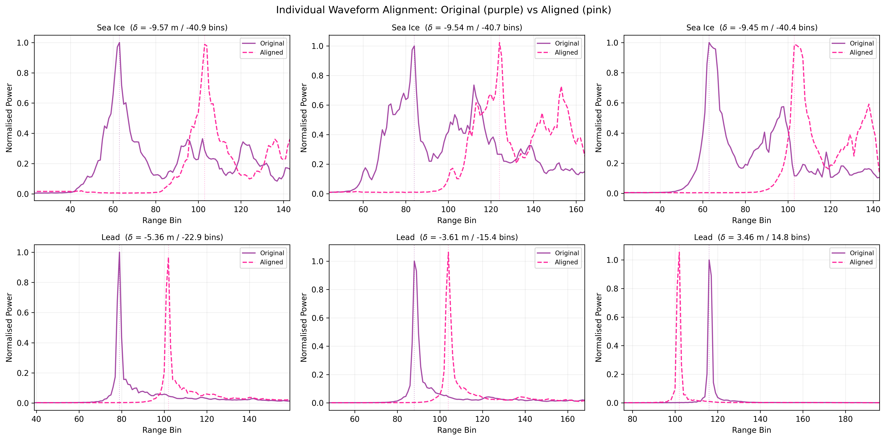
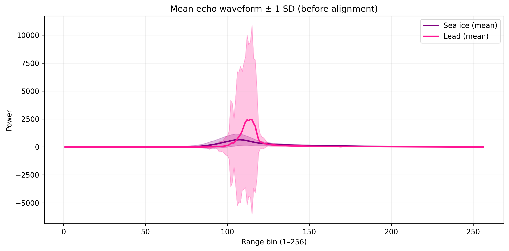
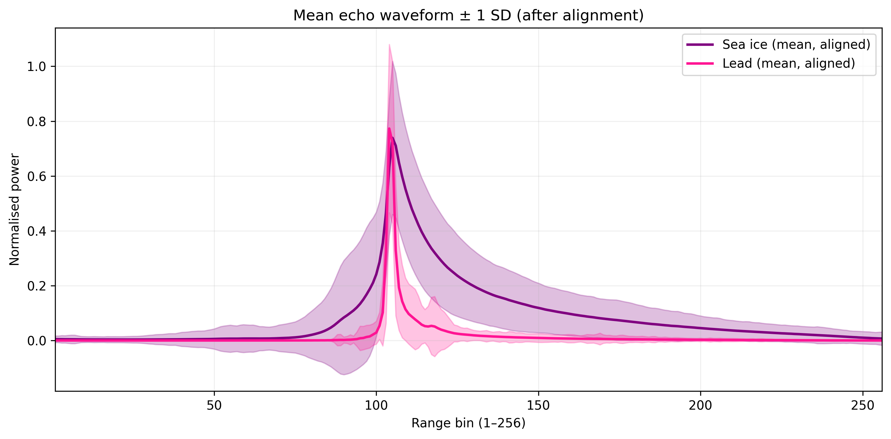
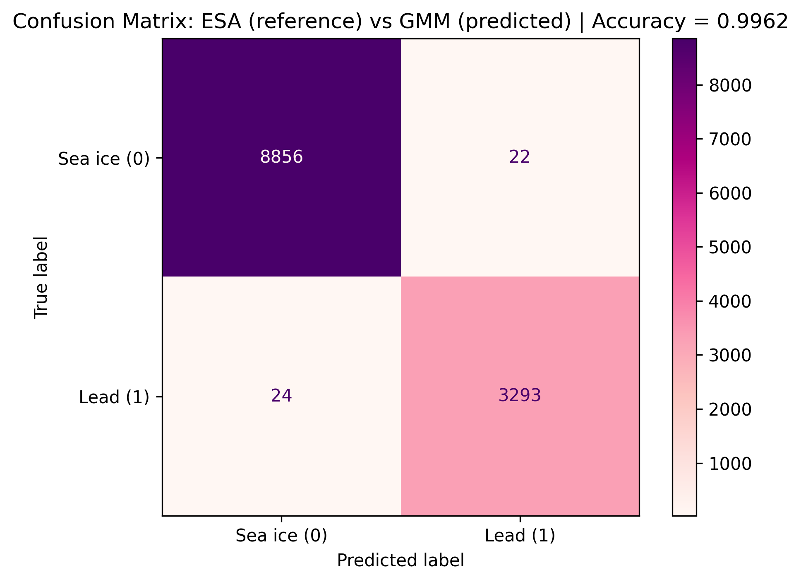
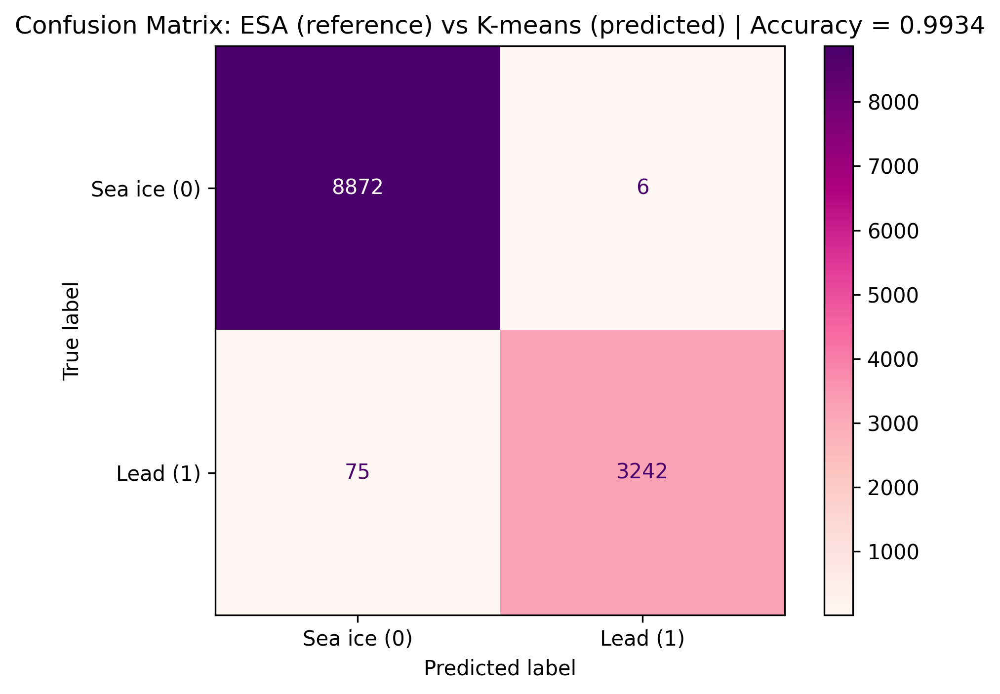

# Unsupervised Classification of Sentinel-3 Altimetry Echoes

This project performs unsupervised classification of Sentinel-3 radar altimetry echoes to discriminate between two surface types:
- Sea ice
- Leads (open water within sea ice)

## Contents

- [Project Background](#project-background)
- [Data](#data)
- [Methodology](#methodology)
  - [Unsupervised classification (K-means and GMM)](#unsupervised-classification-k-means-and-gmm)
  - [Physical waveform alignment](#physical-waveform-alignment)
- [Results](#results)
  - [Mean echo shapes](#mean-echo-shapes)
  - [ESA validation](#esa-validation)
- [Conclusion](#conclusion)
- [How to Run](#how-to-run)

## Project Background 

### Why Collocation Matters

In Earth Observation, many applications link measurements from different sensors. This requires collocation, meaning matching observations in:

- **Space** (overlapping footprint)
- **Time** (same time or within an acceptable window)

Collocation is non-trivial because sensors differ in:

- Spatial resolution  
- Sampling geometry  
- Revisit time  

For example:

- **Sentinel-2 imagery** provides a 2D fixed grid (Eulerian frame) at ~10 m resolution.  
- **Sentinel-3 altimetry** samples along a 1D moving track (Lagrangian frame).  

This results in a mismatch in spatial dimensions when comparing datasets. Echo classification is therefore commonly combined with collocated datasets (such as satellite imagery) to support training, validation, and interpretation.

[Back to top](#unsupervised-classification-of-sentinel-3-altimetry-echoes)

## Data
The analysis uses Sentinel-3 Level-2 radar altimetry data (NetCDF format), comprising:
- **Radar waveforms** (256-bin echoes per observation)
- **ESA surface type classification** (`surf_type_class_20_ku`)
- **Backscatter coefficient** (Sigma0)
- **Echo stack** information used to derive Stack Standard Deviation (SSD)

*More information on Sentinel-3 can be found here [Sentinel-3 mission overview](https://sentinels.copernicus.eu/web/sentinel/copernicus/sentinel-3)*

**Binary Subset Selection**
To focus the classification task, the dataset is restricted to observations labelled by ESA as:
- Sea ice (ESA = 1)
- Lead (ESA = 2)
  
This reduction to a binary ice-lead subset simplifies the discrimination problem and should be considered when interpreting classification performance, as other surface types are excluded from the analysis.

[Back to top](#unsupervised-classification-of-sentinel-3-altimetry-echoes)

## Methodology

### Sentinel-3 Data Loading and Feature Construction

Rather than clustering raw 256-dimensional waveforms directly, the notebook constructs a compact, physically interpretable feature space. Each echo is described using three features:

**Pulse Peakiness (PP)** - Measures how sharp or specular the waveform peak is.
- Leads → specular reflection → high peakiness
- Sea ice → rougher scattering → broader return and lower peakiness

**Stack Standard Deviation (SSD)** - Represents variability across the echo stack (multiple viewing angles), reflecting structural variability in surface scattering.

**Sigma0 (Backscatter)** - Represents radar reflectivity intensity.

Each echo becomes a point in a 3-dimensional feature space. Features are standardised prior to clustering.

## Unsupervised classification (K-means and GMM)

Unsupervised classification means no labels are used to train the model. The algorithm identifies structure in the data without being given surface classes.

### K-means Clustering

K-means clustering is an unsupervised learning algorithm that partitions a dataset into a predefined number of clusters, 
𝑘, by grouping data points according to feature similarity [(MacQueen, 1967)](https://projecteuclid.org/ebooks/berkeley-symposium-on-mathematical-statistics-and-probability/Proceedings-of-the-Fifth-Berkeley-Symposium-on-Mathematical-Statistics-and/chapter/Some-methods-for-classification-and-analysis-of-multivariate-observations/bsmsp/1200512992). The method iteratively assigns each observation to the nearest centroid based on squared Euclidean distance and then updates the centroid positions to minimise within-cluster variance. This assignment-update process continues until convergence, typically reaching a local optimum. K-means is computationally efficient, straightforward to implement, and well suited to exploratory analysis when the underlying data structure is unknown. However, it assumes relatively simple cluster geometry and produces hard class assignments, which may limit flexibility for complex geophysical feature distributions.

Below is a basic code implementation for a K-means Clustering Model:

```
from matplotlib.colors import ListedColormap

# Sample data
X = np.random.rand(100, 2)

# K-means model
kmeans = KMeans(n_clusters=4)
kmeans.fit(X)
y_kmeans = kmeans.predict(X)


# Plotting
cmap_discrete = ListedColormap(plt.cm.RdPu(np.linspace(0.4, 1.0, 4)))
plt.scatter(X[:, 0], X[:, 1], c=y_kmeans, cmap=cmap_discrete)
plt.scatter(centers[:, 0], centers[:, 1], c='black', s=200, alpha=0.6)
plt.title("K-means clustering")
plt.savefig("kmeans_model.png", dpi=300, bbox_inches="tight")
plt.show()
```


### Gaussian Mixture Models (GMMs)

Gaussian Mixture Models (GMMs) are probabilistic clustering methods that represent a dataset as a mixture of Gaussian distributions, each defined by its own mean, covariance, and mixing coefficient [(Reynolds et al., 2009)](https://link.springer.com/rwe/10.1007/978-0-387-73003-5_196). Model parameters are estimated using the Expectation-Maximization (EM) algorithm, which iteratively alternates between estimating the probability of cluster membership (E-step) and maximising the likelihood of the data given those assignments (M-step). Unlike K-means, GMM produces soft probabilistic classifications and allows clusters to adopt elliptical shapes through flexible covariance modelling. This makes GMM particularly suitable for geophysical datasets where feature distributions may overlap or exhibit non-spherical structure, providing a more adaptable framework for unsupervised classification.

Below is a basic code implementation for a GMM Model:

```
from sklearn.mixture import GaussianMixture
import matplotlib.pyplot as plt
import numpy as np

# Sample data
X = np.random.rand(100, 2)

# GMM model
gmm = GaussianMixture(n_components=3)
gmm.fit(X)
y_gmm = gmm.predict(X)

# Plotting
cmap_discrete = ListedColormap(plt.cm.RdPu(np.linspace(0.4, 1.0, 4)))
plt.scatter(X[:, 0], X[:, 1], c=y_gmm, cmap=cmap_discrete)
centers = gmm.means_
plt.scatter(centers[:, 0], centers[:, 1], c='black', s=200, alpha=0.5)
plt.title('Gaussian Mixture Model')
plt.savefig("GMM_model.png", dpi=300, bbox_inches="tight")
plt.show()
```


The notebook runs both methods, treating K-means as a compact baseline and GMM as the main classification approach.


### Mapping Clusters to Physical Classes (Sea Ice vs Lead)

Because clustering is unsupervised, output cluster IDs are arbitrary. The notebook therefore assigns physical meaning using feature interpretation:

- Cluster-level statistics (mean PP, Sigma0, SSD) are computed
- The cluster with higher Pulse Peakiness is assigned as Lead (specular reflections)
- The remaining cluster is assigned as Sea ice

Final label convention used throughout the notebook:

0 = Sea ice

1 = Lead

This ensures physical interpretability of clustering outputs and enables valid comparison to ESA binary labels.

## Physical waveform alignment

Waveforms may be shifted due to tracking window drift. If waveforms are averaged without alignment:

- Peaks smear
- The class-mean echo becomes misleading
 
The notebook applies waveform alignment before computing aligned class-mean waveforms. This demonstrates how waveform registration affects the sharpness and interpretability of averaged echoes. Shifts on the order of ~10 bins correspond to ~23 cm in range, which is significant for cryospheric altimetry measurements.



The figure illustrates individual waveform shifts before and after alignment for both sea ice and lead classes. In several cases, the original waveforms (purple) exhibit noticeable offsets in peak position, whereas the aligned waveforms (pink) are repositioned to a consistent leading-edge location. This correction reduces peak dispersion across samples. The effect is particularly clear for lead echoes, where the specular peak becomes more tightly registered after alignment. For sea ice, broader returns also show improved coherence in the leading-edge region. These examples demonstrate that alignment reduces artificial peak variability caused by tracking-window drift and ensures that subsequent class-mean waveforms are physically meaningful. 

[Back to top](#unsupervised-classification-of-sentinel-3-altimetry-echoes)

## Results 

### Mean echo shapes
Mean ± standard deviation waveforms confirm physically consistent echo behaviour and demonstrate the effect of waveform alignment on class-mean interpretability. The figures below show the difference between before and after alignment. 




**Interpretation**

The comparison between the pre-alignment and post-alignment mean waveforms highlights the importance of waveform registration for physically meaningful averaging. 

Before alignment, the class-mean lead waveform exhibits substantial variance around the peak region, reflected by the large standard deviation envelope. This broad uncertainty band indicates that individual echoes are not temporally aligned, leading to artificial peak smearing in the mean profile. Sea ice echoes show a similar, though less extreme, dispersion.

After alignment, both classes display markedly reduced peak spread. The lead class forms a sharply defined, high-amplitude specular peak with a narrow leading edge, while the sea ice class exhibits a broader and more gradually decaying return consistent with rougher surface scattering. The reduction in standard deviation near the peak demonstrates improved coherence across individual echoes.

These results confirm that waveform alignment is essential for reliable class-mean interpretation and that the physical differences between specular open water and diffuse sea ice scattering become clearer once tracking-window shifts are corrected.

### ESA validation
The confusion matrix below summarises agreement between ESA classification (true labels) and GMM output (predicted labels) within the restricted ice/lead subset.



**Key observations**

The confusion matrix demonstrates very strong agreement between the Gaussian Mixture Model (GMM) predictions and the ESA surface-type labels within the restricted ice/lead subset, with an overall accuracy exceeding 99%. The dominant diagonal structure indicates that both sea ice and lead classes are identified consistently, with only a small number of off-diagonal misclassifications.

The limited number of errors suggests that the three-dimensional feature space (Sigma0, Pulse Peakiness, and Stack Standard Deviation) provides effective physical separation between specular and diffuse echo types. In particular, the high accuracy for the lead class reflects the distinct, sharply peaked waveform signature of open water. The probabilistic nature of GMM allows flexible modelling of cluster covariance, supporting robust separation even where feature distributions partially overlap.

It is important to note that the high performance is influenced by the dataset restriction to ESA-labelled ice and lead only. Ambiguous or mixed surface types have been excluded, meaning the evaluation reflects a controlled binary discrimination task rather than a full multi-class classification problem.

### K-means vs ESA (baseline)
A compact baseline comparison is included using K-means (K = 2). The same PP-based mapping rule is applied to assign physical meaning to the clusters.



**Key observations**

The K-means baseline also achieves high overall accuracy, confirming that the dominant separation between specular leads and rougher sea ice echoes is strong in the selected feature space. The clustering captures the primary structural distinction between the two surface types, with minimal off-diagonal errors in the confusion matrix.

However, K-means relies on hard assignments and implicitly assumes relatively simple cluster geometry. Its slightly lower performance relative to GMM is consistent with its centroid-based partitioning, which does not explicitly model covariance structure. While effective for this binary case, K-means offers less flexibility for handling overlapping or anisotropic feature distributions.

The comparison therefore reinforces the methodological justification for selecting GMM as the primary classifier in this study.

[Back to top](#unsupervised-classification-of-sentinel-3-altimetry-echoes)

## Conclusion
This project demonstrates a workflow for the unsupervised classification of Sentinel-3 radar altimetry echoes into sea ice and leads. By combining compact, physically interpretable feature engineering, probabilistic Gaussian Mixture Model clustering, cluster-to-surface mapping based on radar scattering behaviour, waveform alignment and validation against ESA labels, the method achieves statistically meaningful results. The analysis highlights how machine learning, when integrated with instrument geometry and geophysical understanding, can reliably extract surface-type information from complex radar observations.

[Back to top](#unsupervised-classification-of-sentinel-3-altimetry-echoes)

## How to Run

1. Install dependencies:

```
pip install -r requirements.txt
```
2. Download the Sentinel-3 SAR NetCDF file (`enhanced_measurement.nc`) and update the dataset path inside the notebook.

3. Open and run the notebook: [Week4_Unsupervised_Learning_Methods.ipynb](Week4_Unsupervised_Learning_Methods.ipynb)

[Back to top](#unsupervised-classification-of-sentinel-3-altimetry-echoes)
